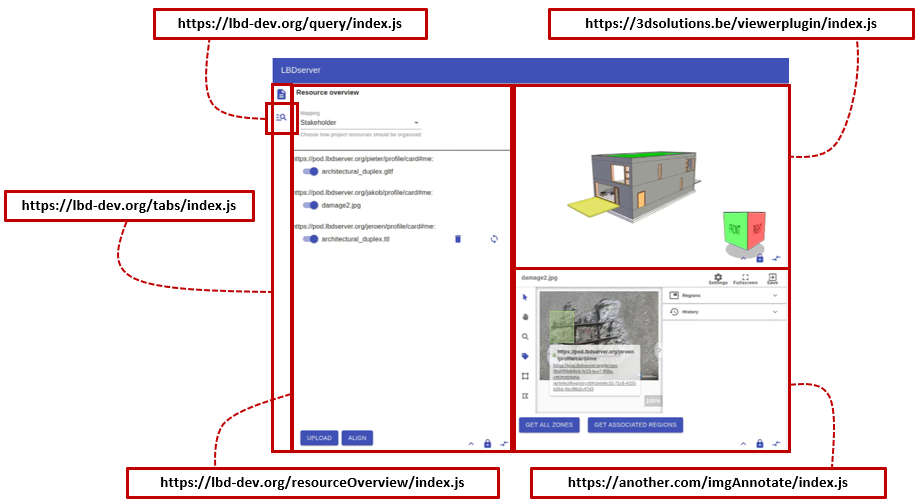
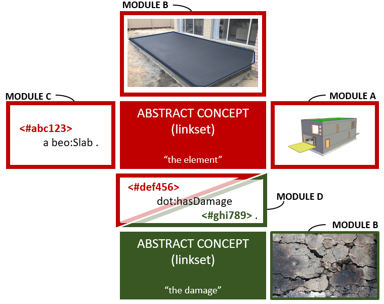
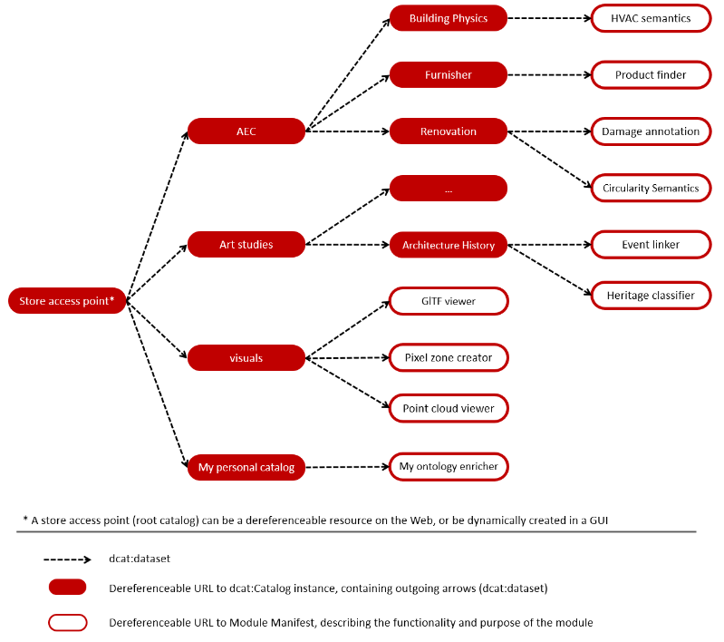

# Bundler of the MIFESTO framework
This is the Bundler application for the Mifesto (Micro frontend store) framework. 

## What is Mifesto?

The [Micro Frontend Store (Mifesto)](#) is a framework to interact with heterogeneous collaborative projects. Its main use case is the built environment, but since the infrastructure is domain-agnostic, any discipline can adopt its main patterns. Mifesto is the GUI part of the patterns proposed in the [ConSolid](https://www.semantic-web-journal.net/content/consolid-federated-ecosystem-heterogeneous-multi-stakeholder-projects-0) ecosystem. Mifesto allows to combine federated interaction modules into a unified application (Figure 2). Modules can be set up to interact with heterogeneous resources such as geometry, imagery, and point clouds.

Resources and their content are considered "representations" of abstract concepts, and are linked as such. The meaning of an abstract concept then comes from combining its federated representations. Hence, a user can select a geometric instance in a 3D viewer, which triggers the selection of the abstract concept, which can be further enriched by other modules by creating new representations. For example, adding imagery or semantics such as classification data, damage records, properties, or history. This principle is demonstrated in Figure 2. To learn more about (federated) abstract concepts and their semantic enrichment, please read the paper available [here](https://www.semantic-web-journal.net/content/consolid-federated-ecosystem-heterogeneous-multi-stakeholder-projects-0).

There are other options for modules, too. For example, for authentication, to create projects, send messages between project partners, or to validate project data against internal rules or external regulations. In fact, this welcome page itself is a module on its own, with its manifest published [here](https://pod.werbrouck.me/aecostore/manifests/welcome) and the code available [here](https://aecostore.github.io/welcome-page/index.js).

Along with its loadable code, a module publishes a semantic manifest. Manifests, in turn, can be combined into Interface Configurations, which wire the modules needed to address a particular use case. Because Manifests and Interface Configurations are dereferenceable, they can be aggregated in decentral catalogs, which themselves can again be aggregated indefinitely. The active "Store" is then formed by reconstructing the complete tree of aggregated modules (Figure 3).

## What is the Bundler application?
In order to aggregate all modules into a single GUI, a Bundler application is needed. This Bundler application is able to allocate and interpret interface configurations and present a consistent graphical user interface to the end-user. In this demo implementation of the Bundler application, we make use of the [Piral.io](https://piral.io) framework, with minor modifications. By default, a [Welcome Configuration](https://raw.githubusercontent.com/AECOstore/RESOURCES/main/configurations/welcome.ttl) is loaded, which contains a page with information about the framework and a page that allows to query a Store catalogue for applicable Interface Configurations. 